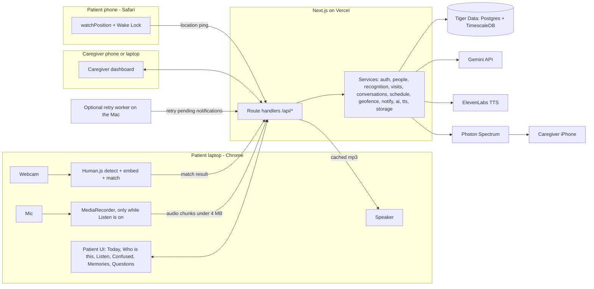

# Waymax — Architecture & Autonomous Build Plan

Oct 2, 2026 · @Smriti

## Locked decisions

Waymax is a Next.js + TypeScript web app on Vercel, with Tiger Data (Postgres) as the only database. Face recognition runs in the patient's browser, and Gemini, ElevenLabs and Photon are the only paid-capable APIs. Everything below follows from these interview answers.

| Topic | Decision |
| --- | --- |
| Time | 36-hour hackathon. Software MVP first, then every remaining software feature. |
| Builder | Claude Code builds everything, unattended, and installs whatever tools it needs. You only create the repo first; API keys come after the build. |
| Demo | Live table demo and a recorded video. A stage demo only if the team advances. |
| Devices | The caregiver view works on a separate device or in another tab on the same laptop. |
| Login | Real caregiver accounts. The patient device pairs with a 6-digit code and never sees a password. |
| Face recognition | In the patient's browser. Free, private, no Python. |
| Conversation capture | Nothing is recorded until someone taps "Listen". Store the transcript and summary, never raw audio. |
| Spoken name | Name and relationship show on screen automatically. They are spoken only when the patient taps "Who is this?" |
| Unknown face | Patient can tap "Add this person". It goes to the caregiver's approval queue. |
| Location | A patient-phone page shares GPS while open. A caregiver "simulate walk" control drives the demo. The same endpoint accepts iOS Shortcuts later. |
| Alerts | Photon iMessage first. Fallback is an in-app alert on the caregiver dashboard. No Twilio. |
| Team hardware | Someone has an iPhone and a Mac. |
| Budget | $10 hard cap. Stay on free tiers and sponsor credits. |
| Calming music | 3–4 bundled royalty-free tracks. |
| Confusion recap | Dashboard only, as daily counts and a chart. |
| Demo data | Teammates' real faces and photos. No special privacy rules. |
| Sponsors targeted | Photon, Gemini, ElevenLabs, Tiger Data. GoDaddy later if deployed. Presage as a future extension. |

## Step 2 — Recommended stack

One Next.js app on Vercel talks to one Tiger Data Postgres database, and nothing else is self-hosted. Expected cost for the hackathon is $0. The only things that can bill you are listed in the cost-flag column.

| Layer | Choice | Why it fits | Cheaper / simpler alternative | Cost flag |
| --- | --- | --- | --- | --- |
| Frontend | Next.js (latest stable, App Router), React, TypeScript, Tailwind CSS | One codebase for patient UI, caregiver UI and API. Claude Code knows it well. | Vite + React SPA plus a separate API (more pieces) | None |
| Backend | Next.js Route Handlers and Server Actions, Node runtime | No separate server to deploy. | Express on Render (extra deploy, cold starts) | None |
| Database | Tiger Data free service (Postgres + TimescaleDB) | Normal relational tables for people and schedules. Hypertables and continuous aggregates for location pings and "I feel confused" presses. Free plan gives 750 MB; it turns read-only at the cap. | Neon or Supabase free Postgres (no sponsor prize) | Free. Do not click "convert to standard" or start the paid trial. |
| ORM | Drizzle ORM + drizzle-kit migrations | TypeScript-first, plain SQL escape hatch for Timescale functions. | Raw SQL with `postgres` driver | None |
| Auth | Hand-rolled: email + password (bcryptjs), session table, httpOnly cookie. Patient devices pair with a 6-digit code and get a device token. | Fewest dependencies. Pairing code fits a patient who should never type a password. | Auth.js / Better Auth (more config surface for Claude Code to fight) | None |
| Face recognition | `@vladmandic/human` in the browser (face detect + face embedding) | Runs on the patient laptop. No Python, no server GPU, no cost. Video never leaves the device. | face-api.js fork (older models) | None |
| "Audio recognition" | Gemini transcribes the Listen recording with speaker turns. It also extracts any spoken self-introduction ("Hi Mom, it's Priya") to cross-check the face match. | A real voiceprint model in the browser is unreliable at hackathon speed. This gives the second layer without one. | Skip audio identity, transcripts only | Gemini free tier |
| LLM | Gemini Flash (model id in `GEMINI_MODEL`, default `gemini-3-flash-preview`, fallback `gemini-3.1-flash-lite`) | Transcription, conversation summaries, recaps, memory narration. All structured JSON. | No LLM at all for recaps (template strings) | Free tier. Avoid any 2.5 model: Gemini 2.5 is scheduled to shut down on 16 October 2026. |
| Text-to-speech | ElevenLabs `eleven_flash_v2_5` | Warm, calm voice for names, today card, calming mode. Audio is cached per text, so each phrase is paid for once. | Browser `speechSynthesis` (free, robotic). Built in as the fallback. | Free plan: 10,000 credits/month, Flash costs 0.5 credit per character, so about 20,000 characters. Free plan requires attribution. |
| Messaging | Photon Spectrum (`spectrum-ts`), iMessage provider, Spectrum Cloud | Geofence alerts to caregivers' iPhones. Required for the Photon track. | In-app alert only (already the fallback) | Free shared line pool. Use promo code HACKWITHPHOTON if billing is asked. |
| Maps | Leaflet + react-leaflet + OpenStreetMap tiles | Draw the geofence circle and live dot. No API key. | Plain lat/long text | None |
| Charts | Recharts | Confusion-press chart on the dashboard. | Hand-drawn SVG bars | None |
| File storage | Postgres `media_blobs` table (bytea) behind a `StorageProvider` interface | Photos are resized to ≤300 KB in the browser before upload; cached TTS clips are \~30 KB. A demo with 50 photos is \~15 MB. No extra account. | Vercel Blob (swap in later through the same interface) | None |
| Realtime | Polling with SWR every 5 seconds | Alerts and approvals don't need sockets at demo scale. | — | None |
| Hosting | Vercel Hobby | Free HTTPS, which camera, mic and GPS all require. | Run locally with `next dev` and ngrok | Free. Hobby is non-commercial and caps request bodies at 4.5 MB, so audio uploads are chunked. |
| Testing | Vitest (unit/integration), Playwright (E2E) | Standard, fast. | — | None |

What we are deliberately **not** using: no vector database, no RAG, no embeddings service, no agents framework, no Redis, no queue, no websockets, no Python, no Twilio. The face gallery per patient is tens of vectors, so matching is a loop in the browser. Repeat-question answers are written by the caregiver and never generated, because consistency is the whole point.

## Sponsor tracks

Four sponsors fit naturally and go in the MVP: Photon, Gemini, ElevenLabs and Tiger Data. GoDaddy is an optional add-on after deploy, and Presage is a future extension. Solana, Capital One Nessie and SpaceX/Grok are left out.

| Sponsor | What it provides | Fits the MVP? | Where it plugs in | Setup | Cost | Complexity | Demo value | Label |
| --- | --- | --- | --- | --- | --- | --- | --- | --- |
| Photon (Spectrum) | Agents and messages in iMessage | Yes — you already need caregiver alerts | Geofence exit/return alerts. Optional: caregiver replies "OK" to acknowledge. | Photon account, Spectrum project, project ID + secret | Free shared line; promo HACKWITHPHOTON | Low–medium | High: a real iMessage pops on a judge's phone | Core/natural |
| Gemini API | Multimodal LLM | Yes | Conversation transcription + summary, visit recaps, memory narration scripts, voice-claim cross-check | AI Studio API key | Free tier on Flash models | Low | High | Core/natural |
| ElevenLabs | Natural TTS | Yes — names must be spoken | "Who is this?" announcement, today card read-aloud, calming-mode orientation, repeat-question answers, memory narration | Account + API key + chosen voice ID | Free 10k credits/month | Low | High: the voice makes the demo feel kind, not robotic | Core/natural |
| Tiger Data | Postgres + TimescaleDB | Yes — it's the main DB | Hypertables for location pings and patient events; continuous aggregate for daily confusion counts that drives the dashboard chart | Tiger Cloud account, free service, connection string | Free 750 MB | Low (one SQL migration for Timescale features) | Medium: show the continuous aggregate powering the chart | Core/natural |
| GoDaddy Registry | Domain names | Optional | Point a domain at the Vercel deploy | Register domain, add DNS records in Vercel | A domain usually costs money; check for a hackathon promo before buying | Very low | Low–medium | Optional enhancement |
| Presage | Camera-based vitals and emotion | Partly | Could detect distress passively and suggest calming mode. The patient button already covers the MVP. | SDK + credits | Free dev credits | Medium–high | Medium | Optional enhancement (later) |
| Grok Voice / SpaceX | Voice API, requires building with Cursor | No | Duplicates ElevenLabs. Claude Code is building, so the Cursor requirement fails. | — | — | — | — | Not a good fit |
| Solana | Blockchain payments/identity | No | Nothing in the product needs on-chain anything | — | — | — | — | Not a good fit |
| Capital One Nessie | Mock banking data | No | No financial feature in Waymax | — | — | — | — | Not a good fit |

One Photon detail worth knowing for later: Photon's Advanced iMessage kit can request and watch shared Find My locations. That could replace the phone web page as the patient's real location source. It is listed under "design for later" and not built now.

## Step 3 — Accounts, keys and env vars

You do all of this **after** the build, only when Claude Code asks at task T20. It writes `SETUP_NEEDED.md` listing exactly these items, waits for you, then verifies each key. You'll need 6 accounts, 5 keys and 1 voice ID, and none of them needs a credit card. The `SPECTRUM_*` names are the ones the Photon SDK reads by default.

### Accounts to create and keys to generate

| Service | Why | Setup | Env var(s) | Free/paid | Potential cost |
| --- | --- | --- | --- | --- | --- |
| GitHub | Repo for Claude Code and Vercel | Create empty repo `waymax` | — | Free | $0 |
| Tiger Data (Tiger Cloud) | Main database | Sign up → create a **Free Plan** service → copy the connection string | `DATABASE_URL` | Free | $0. Never start the $1000 trial or convert the service. |
| Google AI Studio | Gemini API | Sign in → "Get API key" → create key in a new project. Don't enable billing. | `GEMINI_API_KEY`, `GEMINI_MODEL`, `GEMINI_FALLBACK_MODEL` | Free tier | $0 without billing. Free-tier prompts may be used by Google to improve models; fine for demo data. |
| ElevenLabs | Speech | Sign up → Profile → API keys → create key. In Voice Library pick one calm voice and copy its voice ID. | `ELEVENLABS_API_KEY`, `ELEVENLABS_VOICE_ID`, `ELEVENLABS_MODEL_ID` | Free plan | $0. If you upgrade, Starter is about $5/month. |
| Photon | iMessage alerts | Sign up at app.photon.codes → create project → enable Spectrum → wait for an iMessage line to be assigned → copy project ID and secret from Settings | `SPECTRUM_PROJECT_ID`, `SPECTRUM_PROJECT_SECRET` (`SPECTRUM_WEBHOOK_SECRET` only if you add inbound replies) | Free with promo | $0 with HACKWITHPHOTON |
| Vercel | Hosting | Sign up with GitHub, Hobby plan. **Run vercel login in your terminal when Claude Code asks; it links and deploys the project itself**. | Claude Code copies all vars to Vercel with the CLI | Free | $0 |

### Values Claude Code sets for you

| Env var | Value | Secret? |
| --- | --- | --- |
| `SESSION_SECRET` | Generated with `openssl rand -base64 32` in T0 | Yes |
| `WORKER_SECRET` | Generated the same way (protects the notification retry endpoint) | Yes |
| `DATABASE_URL` / `TEST_DATABASE_URL` | Local Postgres + TimescaleDB during the build; `DATABASE_URL` switches to your Tiger URL in T20 | Yes |
| `NEXT_PUBLIC_APP_URL` | `http://localhost:3000`, then your Vercel URL in T20 | No |
| `NEXT_PUBLIC_DEMO_MODE` | `true` (shows "simulate walk" and demo tools) | No |
| `NOTIFY_MODE` | `in_app` during the build, `photon` once your Photon keys pass verification | No |
| `AI_MOCK` | `true` during the build, `false` once your keys pass | No |

### Billing

No service needs billing turned on. If any dashboard asks for a card, skip it. The two places costs could sneak in are turning on Gemini billing (then Pro models and heavy use cost money) and buying a domain.

### Things Claude Code creates automatically

All tooling (pnpm, Playwright browsers, local Postgres + TimescaleDB, Vercel CLI), `.env.local` with local values and generated secrets, the database schema and migrations, Timescale hypertables and continuous aggregates, seed data (demo caregiver, patient, people, schedule, questions), `.env.example`, face-recognition model files (copied from `node_modules` into `public/models`), the test setup, `SETUP_NEEDED.md`, and the Vercel project and deploy.

### Do NOT set up

Twilio or any SMS provider, Redis, Pinecone or any vector DB, Firebase, Supabase, AWS/S3, Vercel Blob, a separate Express/FastAPI server, Google Maps API, Auth0/Clerk, Grok/xAI, Solana, Nessie, Presage (later), or a GoDaddy domain (only after deploy, and only if free).

## Step 4 — Manual setup before Claude Code starts

This takes about 5 minutes. Claude Code installs every tool it needs, builds and tests everything with mocks and a local database, and asks you for API keys only once, at the end (task T20).

- [ ] Check Claude Code runs and is logged in: `claude --version`.
- [ ] Create an empty GitHub repo `waymax` (no README), then clone it: `git clone git@github.com:<you>/waymax.git && cd waymax`
- [ ] Export this doc as Markdown and save it as `PLAN.md` in the repo root.
- [ ] Create `.claude/settings.json` so Claude Code can install packages and run commands without stopping:

```json
{
  "permissions": {
    "allow": [
      "Bash(pnpm:*)", "Bash(npm:*)", "Bash(npx:*)", "Bash(node:*)", "Bash(corepack:*)",
      "Bash(brew:*)", "Bash(docker:*)", "Bash(psql:*)", "Bash(createdb:*)", "Bash(pg_ctl:*)",
      "Bash(timescaledb-tune:*)", "Bash(vercel:*)", "Bash(openssl:*)", "Bash(curl:*)",
      "Bash(git:*)", "Bash(mkdir:*)", "Bash(cp:*)", "Bash(mv:*)", "Bash(ls:*)", "Bash(cat:*)",
      "Bash(chmod:*)", "Bash(lsof:*)",
      "Edit", "Write", "Read", "WebFetch", "WebSearch"
    ],
    "deny": ["Bash(sudo:*)", "Bash(rm -rf /*)", "Bash(rm -rf ~*)"]
  }
}
```

- [ ] Commit `PLAN.md` and `.claude/settings.json`, then push.
- [ ] Run `claude` in the repo and paste this prompt:

```
Read PLAN.md fully. Implement it end to end by following §9 task by task, in order.
Obey the autonomous-build rules in §14. You may install any tools and packages this
build needs on this computer (rule 15). Do not ask me anything before T20: build and
test everything with mocks and a local database, record decisions in DECISIONS.md,
and commit after every task with a message starting with the task id.
At T20, write SETUP_NEEDED.md with every account, key and command you need from me,
show me a short summary, and wait. After I say the keys are in .env.local, verify them,
finish T20 and the §13 checklist.
```

- [ ] Optional, any time before the demo: drop 3–4 calm royalty-free tracks named `calm-1.mp3` … into `public/audio/calm/` (otherwise the app uses a generated ambient tone), and keep 3–5 clear face photos per teammate handy for the caregiver UI.

# Step 5 — Implementation plan (hand this to Claude Code)

## 1. Project objective

Waymax is a web app that helps a person with Alzheimer's know who is in front of them, what today holds, and where they are, while keeping caregivers informed. The finished MVP must do these things on a deployed URL:

1. A caregiver signs up, creates a patient, sets home location and a geofence radius, adds alert phone numbers, and pairs the patient laptop and patient phone with 6-digit codes.
2. The patient laptop shows a calm **Today** card (day, date, time, visitors, activities, what's next) as its idle screen.
3. When a known person appears on the webcam, the screen shows their photo, name, relationship and a one-line recap of last visit. Tapping **Who is this?** speaks it in an ElevenLabs voice.
4. When an unknown face appears, the patient can tap **Add this person**. The caregiver sees it in an approval queue, names it, adds relationship, notes, photos and routines.
5. Tapping **Listen** records the conversation in chunks. Gemini turns it into a transcript and summary, and raw audio is deleted. The summary feeds the next visit's recap.
6. The patient phone page shares GPS. When the patient leaves the geofence, every caregiver alert number gets an iMessage through Photon, and the dashboard shows an alert. A demo control simulates a walk.
7. **I feel confused** opens calming mode: where you are, the time, today's plan, then a choice of soothing music or memories. Each press is logged and charted daily on the caregiver dashboard.
8. **Memories mode** plays a slideshow of a chosen person's photos with narrated memories.
9. **Questions** shows caregiver-written buttons ("Where is my wife?") with calm, consistent spoken answers.

## 2. Final architecture

Three browser clients talk to one Next.js app, which owns all business logic and is the only thing that talks to the database and outside APIs. Face matching happens in the patient's browser; only the match result goes to the server.



How data flows:

- **Recognition:** the patient page downloads the patient's face gallery (approved people's embeddings) once and refreshes every 60 s. Each frame batch (2 fps) is matched locally. A stable match (same person in 3 of the last 5 checks) posts a `recognition_event`. The server opens or extends a `visit` and returns the person card with a recap.
- **Unknown face:** an unknown face that stays for 3 s shows "Someone is here." Tapping **Add this person** posts the embedding and a cropped snapshot. That creates a `person` with status `pending`.
- **Conversation:** Listen uploads a chunk every 60 s. Each chunk is transcribed by Gemini, the text is stored and the audio discarded. On Stop, Gemini summarizes the whole transcript into `conversations.summary` and extracts facts.
- **Location:** each ping is written to the `location_pings` hypertable. The geofence service compares distance from the active fence and changes `patients.geofence_state` only after 2 consecutive outside readings. A state change writes a `notification` and tries Photon immediately.
- **Speech:** any spoken text goes through `/api/tts`. That hashes voice + text, returns a cached clip if it exists, and otherwise calls ElevenLabs and stores the result. If ElevenLabs fails, the client uses `speechSynthesis`.
- **Confusion:** each press writes a `patient_events` row. A continuous aggregate rolls it into daily counts for the dashboard chart.

## 3. Final tech stack

Use the latest stable release of each package at install time, then pin exact versions in `package.json` and record them in `DECISIONS.md`.

| Area | Package / tool |
| --- | --- |
| Runtime | Node 22 LTS, pnpm |
| Framework | `next` (latest stable, App Router, `src/` dir), `react`, `react-dom` |
| Language | TypeScript, `strict: true` |
| Styling | Tailwind CSS v4, plus a small in-repo component set (Button, Card, Modal, Toast). No component library. |
| Validation | `zod` for every request body and every Gemini JSON response |
| Data fetching | `swr` |
| DB | `drizzle-orm`, `drizzle-kit`, `postgres` (postgres.js) |
| Auth | `bcryptjs`, Node `crypto` for tokens |
| Face | `@vladmandic/human` (v3.x), models copied to `public/models/human/` by a `postinstall` script |
| LLM | `@google/genai` (official Google Gen AI JS SDK) |
| TTS | ElevenLabs REST API via `fetch` (`POST https://api.elevenlabs.io/v1/text-to-speech/{voice_id}`) — no SDK dependency |
| Messaging | `spectrum-ts` (iMessage provider, cloud mode) |
| Maps | `leaflet`, `react-leaflet`, OpenStreetMap tiles |
| Charts | `recharts` |
| Dates | `date-fns`, `date-fns-tz` |
| Tests | `vitest`, `@testing-library/react`, `@playwright/test`, `msw` for API mocks |
| Lint | ESLint (Next config), Prettier |

## 4. Database

22 tables plus 1 continuous aggregate. Three tables are TimescaleDB hypertables: `location_pings`, `patient_events` and `recognition_events`. Everything is keyed by `patient_id`, so one caregiver can manage many patients. The `devices` table is the hook for future hardware.

Relationships in one line each:

- A caregiver links to many patients through `patient_caregivers`, and a patient can have many caregivers.
- A patient has many `devices`, `geofences`, `alert_contacts`, `people`, `schedule_items`, `questions`, `visits`, `conversations` and `notifications`.
- A person has many `face_embeddings` and `person_memories`, and appears in `visits`, `conversations` and `schedule_items`.
- `media_blobs` holds every binary: photos, face snapshots, cached TTS audio.

The DDL below is authoritative. Write it as a Drizzle schema in `src/db/schema.ts`, generate migration `0000`, then add a **custom** migration `0001_timescale.sql` (`pnpm drizzle-kit generate --custom --name=timescale`) for the Timescale parts.

```sql
-- enums
create type caregiver_role as enum ('owner','member');
create type device_kind as enum ('patient_display','patient_phone','webcam','earpiece','smart_speaker','led_display','other');
create type geofence_kind as enum ('home','temporary');
create type geofence_state as enum ('unknown','inside','outside');
create type person_status as enum ('pending','approved','rejected');
create type created_via as enum ('caregiver','patient_device','seed');
create type embedding_source as enum ('upload','webcam_capture');
create type memory_kind as enum ('note','photo','story');
create type recog_source as enum ('face','voice','manual');
create type convo_status as enum ('recording','processing','done','failed');
create type schedule_kind as enum ('visit','activity','therapy','meal','other');
create type event_kind as enum ('confused_pressed','calming_music','calming_memories','question_asked','who_is_this','memories_opened','listen_started');
create type location_source as enum ('browser','shortcut','simulated','device');
create type notif_kind as enum ('geofence_exit','geofence_return','person_pending','test');
create type delivery_status as enum ('skipped','pending','sent','failed');

create table caregivers (
  id uuid primary key default gen_random_uuid(),
  email text not null unique,              -- stored lowercase
  password_hash text not null,
  name text not null,
  phone_e164 text,
  created_at timestamptz not null default now()
);

create table sessions (
  id text primary key,                     -- sha256 of the cookie token
  caregiver_id uuid not null references caregivers(id) on delete cascade,
  expires_at timestamptz not null,
  created_at timestamptz not null default now()
);
create index on sessions (caregiver_id);

create table patients (
  id uuid primary key default gen_random_uuid(),
  name text not null,
  preferred_name text not null,
  timezone text not null default 'America/New_York',
  home_label text not null default 'Home',
  home_lat double precision,
  home_lng double precision,
  geofence_state geofence_state not null default 'unknown',
  geofence_state_changed_at timestamptz,
  outside_streak int not null default 0,   -- consecutive outside pings
  last_location_at timestamptz,
  created_at timestamptz not null default now()
);

create table patient_caregivers (
  patient_id uuid not null references patients(id) on delete cascade,
  caregiver_id uuid not null references caregivers(id) on delete cascade,
  role caregiver_role not null default 'owner',
  primary key (patient_id, caregiver_id)
);
create index on patient_caregivers (caregiver_id);

create table devices (
  id uuid primary key default gen_random_uuid(),
  patient_id uuid not null references patients(id) on delete cascade,
  kind device_kind not null,
  label text not null,
  token_hash text not null unique,         -- sha256 of device token
  capabilities jsonb not null default '{}', -- e.g. {"camera":true,"speaker":true,"gps":false}
  last_seen_at timestamptz,
  revoked_at timestamptz,
  created_at timestamptz not null default now()
);
create index on devices (patient_id);

create table pairing_codes (
  code char(6) primary key,
  patient_id uuid not null references patients(id) on delete cascade,
  device_kind device_kind not null,
  created_by uuid not null references caregivers(id),
  expires_at timestamptz not null,         -- now() + 10 min
  used_at timestamptz
);

create table geofences (
  id uuid primary key default gen_random_uuid(),
  patient_id uuid not null references patients(id) on delete cascade,
  kind geofence_kind not null,
  label text not null,
  center_lat double precision not null,
  center_lng double precision not null,
  radius_m int not null check (radius_m between 50 and 20000),
  active_from timestamptz,
  active_until timestamptz,
  is_active boolean not null default true,
  created_at timestamptz not null default now(),
  check (kind = 'home' or (active_from is not null and active_until is not null and active_until > active_from))
);
create unique index one_home_fence on geofences (patient_id) where kind = 'home';
create index on geofences (patient_id, is_active);

create table alert_contacts (
  id uuid primary key default gen_random_uuid(),
  patient_id uuid not null references patients(id) on delete cascade,
  name text not null,
  phone_e164 text not null check (phone_e164 ~ '^\+[1-9][0-9]{7,14}$'),
  notify_geofence boolean not null default true,
  created_at timestamptz not null default now(),
  unique (patient_id, phone_e164)
);

create table media_blobs (
  id uuid primary key default gen_random_uuid(),
  patient_id uuid not null references patients(id) on delete cascade,
  mime text not null,
  bytes bytea not null,
  size_bytes int not null check (size_bytes <= 2000000),
  sha256 text not null,
  created_at timestamptz not null default now(),
  unique (patient_id, sha256)
);

create table people (
  id uuid primary key default gen_random_uuid(),
  patient_id uuid not null references patients(id) on delete cascade,
  status person_status not null default 'pending',
  name text,                               -- null while pending
  relationship text,                       -- 'daughter', 'neighbor'
  spoken_name text,                        -- pronunciation hint for TTS
  description text,
  visit_routine text,                      -- 'Visits Sundays after lunch'
  narration jsonb,                         -- cached Memories-mode script
  narration_hash text,                     -- hash of the inputs that produced it
  primary_photo_id uuid references media_blobs(id) on delete set null,
  created_via created_via not null,
  approved_by uuid references caregivers(id),
  approved_at timestamptz,
  created_at timestamptz not null default now(),
  check (status <> 'approved' or (name is not null and relationship is not null))
);
create index on people (patient_id, status);

create table face_embeddings (
  id uuid primary key default gen_random_uuid(),
  person_id uuid not null references people(id) on delete cascade,
  model text not null,                     -- e.g. 'human-faceres'
  dim int not null,
  embedding real[] not null,
  source embedding_source not null,
  media_id uuid references media_blobs(id) on delete set null,
  created_at timestamptz not null default now(),
  check (array_length(embedding, 1) = dim)
);
create index on face_embeddings (person_id);

create table person_memories (
  id uuid primary key default gen_random_uuid(),
  person_id uuid not null references people(id) on delete cascade,
  kind memory_kind not null,
  title text not null,
  body text,
  media_id uuid references media_blobs(id) on delete set null,
  occurred_on date,
  created_at timestamptz not null default now()
);
create index on person_memories (person_id);

create table visits (
  id uuid primary key default gen_random_uuid(),
  patient_id uuid not null references patients(id) on delete cascade,
  person_id uuid not null references people(id) on delete cascade,
  started_at timestamptz not null default now(),
  last_seen_at timestamptz not null default now(),
  ended_at timestamptz
);
create index on visits (patient_id, started_at desc);
create index on visits (person_id, started_at desc);

create table conversations (
  id uuid primary key default gen_random_uuid(),
  patient_id uuid not null references patients(id) on delete cascade,
  visit_id uuid references visits(id) on delete set null,
  person_id uuid references people(id) on delete set null,
  status convo_status not null default 'recording',
  transcript text not null default '',
  summary text,
  key_facts jsonb not null default '[]',    -- ["Got a puppy named Max"]
  speaker_claim jsonb,                      -- {"claimedName":"Priya","matchesFace":true}
  started_at timestamptz not null default now(),
  ended_at timestamptz
);
create index on conversations (person_id, started_at desc);

create table conversation_chunks (
  id uuid primary key default gen_random_uuid(),
  conversation_id uuid not null references conversations(id) on delete cascade,
  seq int not null,
  transcript text,
  status convo_status not null default 'processing',
  error text,
  created_at timestamptz not null default now(),
  unique (conversation_id, seq)
);

create table schedule_items (
  id uuid primary key default gen_random_uuid(),
  patient_id uuid not null references patients(id) on delete cascade,
  kind schedule_kind not null,
  title text not null,
  person_id uuid references people(id) on delete set null,
  starts_at timestamptz,                   -- one-off item
  days_of_week smallint[],                 -- weekly item, 0=Sun..6=Sat
  start_time time,                         -- weekly item, patient local time
  duration_min int not null default 60 check (duration_min between 5 and 720),
  notes text,
  created_at timestamptz not null default now(),
  check ((starts_at is not null) <> (days_of_week is not null and start_time is not null))
);
create index on schedule_items (patient_id);

create table questions (
  id uuid primary key default gen_random_uuid(),
  patient_id uuid not null references patients(id) on delete cascade,
  question text not null,
  answer text not null,
  sort_order int not null default 0,
  is_active boolean not null default true,
  created_at timestamptz not null default now()
);
create index on questions (patient_id, sort_order);

create table notifications (
  id uuid primary key default gen_random_uuid(),
  patient_id uuid not null references patients(id) on delete cascade,
  kind notif_kind not null,
  title text not null,
  body text not null,
  dedupe_key text not null unique,         -- e.g. 'geofence_exit:<patient>:<state_changed_at>'
  photon_status delivery_status not null default 'pending',
  photon_attempts int not null default 0,
  photon_last_error text,
  read_at timestamptz,
  created_at timestamptz not null default now()
);
create index on notifications (patient_id, created_at desc);
create index on notifications (photon_status) where photon_status = 'pending';

create table tts_cache (
  key text primary key,                    -- sha256(provider|model|voice|text)
  text text not null,
  provider text not null,                  -- 'elevenlabs'
  media_id uuid not null references media_blobs(id) on delete cascade,
  created_at timestamptz not null default now()
);

-- hypertables: primary keys must include the time column
create table location_pings (
  patient_id uuid not null references patients(id) on delete cascade,
  device_id uuid references devices(id) on delete set null,
  lat double precision not null check (lat between -90 and 90),
  lng double precision not null check (lng between -180 and 180),
  accuracy_m real,
  source location_source not null,
  recorded_at timestamptz not null,
  received_at timestamptz not null default now()
);

create table patient_events (
  patient_id uuid not null references patients(id) on delete cascade,
  device_id uuid references devices(id) on delete set null,
  kind event_kind not null,
  payload jsonb not null default '{}',
  occurred_at timestamptz not null default now()
);

create table recognition_events (
  patient_id uuid not null references patients(id) on delete cascade,
  device_id uuid references devices(id) on delete set null,
  person_id uuid references people(id) on delete set null,  -- null = unknown face
  source recog_source not null,
  confidence real not null check (confidence between 0 and 1),
  detected_at timestamptz not null default now()
);
```

`0001_timescale.sql` (custom migration):

```sql
create extension if not exists timescaledb;
select create_hypertable('location_pings', by_range('recorded_at', interval '1 day'), if_not_exists => true);
select create_hypertable('patient_events', by_range('occurred_at', interval '7 days'), if_not_exists => true);
select create_hypertable('recognition_events', by_range('detected_at', interval '7 days'), if_not_exists => true);
create index if not exists location_pings_patient_time on location_pings (patient_id, recorded_at desc);
create index if not exists patient_events_patient_time on patient_events (patient_id, occurred_at desc);
create index if not exists recognition_events_patient_time on recognition_events (patient_id, detected_at desc);

create materialized view patient_events_daily
with (timescaledb.continuous, timescaledb.materialized_only = false) as
select time_bucket(interval '1 day', occurred_at, 'America/New_York') as day,
       patient_id, kind, count(*)::int as n
from patient_events
group by day, patient_id, kind
with no data;

select add_continuous_aggregate_policy('patient_events_daily',
  start_offset => interval '30 days', end_offset => interval '1 hour',
  schedule_interval => interval '15 minutes');

alter table location_pings set (timescaledb.compress, timescaledb.compress_segmentby = 'patient_id');
select add_compression_policy('location_pings', interval '7 days');
```

Notes for Claude Code:

- `materialized_only = false` makes new presses appear in the chart immediately.
- The daily bucket uses one fixed timezone for the demo. Record this in `DECISIONS.md`.
- If any Timescale call fails on the free service, the app must still work: wrap the dashboard query so it falls back to a plain `group by date_trunc('day', ...)` on `patient_events`, and log a warning.
- `pnpm db:migrate` runs both migrations; `pnpm db:seed` loads demo data; `pnpm db:reset` drops everything and re-runs both. The reset script must refuse to run when `NODE_ENV=production`.

## 5. AI architecture

Waymax uses three AI pieces: a face model in the browser, Gemini Flash for language and audio, and ElevenLabs for speech. Every AI call has a non-AI fallback, so the demo never dead-ends. Recognition cards, the today card and question answers involve **no** LLM call at display time, which keeps them instant and consistent.

### 5.1 Face recognition (browser)

- **Model / provider:** `@vladmandic/human` face detector + face description (embedding) models, loaded from `/models/human/`. Backend `webgl`, falling back to `wasm`.
- **Why:** free, private, no Python, works offline once loaded.
- **Inputs:** webcam frames at 2 fps (a `FrameSource` interface; default implementation is `getUserMedia` with a selectable `deviceId`).
- **Outputs:** for each face, an embedding (store its length as `dim`) plus box and confidence.
- **Matching:** `human.match.find(embedding, gallery)` against all approved people's embeddings. A match counts when similarity ≥ `NEXT_PUBLIC_FACE_MATCH_THRESHOLD` (default `0.55`, tune on the team's faces and record the value). A person is "recognized" after 3 of the last 5 checks agree. An unknown face is declared after 3 s of faces present with no match.
- **Enrollment:** caregiver uploads photos, and the caregiver's browser runs the same model. Reject photos with 0 or 2+ faces, or a face box under 80 px. Require 3 embeddings per person for `approved`; warn but allow 1–2. Webcam capture from the unknown flow counts as 1.
- **Error handling:** model load failure, no camera permission, or no faces for a long time all show a gentle banner on the caregiver side only. The patient still has a manual **Who's here?** picker (writes `recognition_events.source = 'manual'`).
- **Cost:** $0.

### 5.2 Conversation transcription (Gemini)

- **Model:** `GEMINI_MODEL` (default `gemini-3-flash-preview`), retry once on `GEMINI_FALLBACK_MODEL` (`gemini-3.1-flash-lite`). Read both from env; never hard-code. Task T0 verifies the ids against the live model list.
- **Inputs:** one WAV chunk, 16 kHz mono, 45 s (\~1.4 MB, safely under Vercel's 4.5 MB body limit), sent as `inlineData` with `mimeType: 'audio/wav'`. Record with an AudioWorklet and downsample in the browser. Don't use MediaRecorder WebM; WAV is the safest format for Gemini.
- **Outputs (JSON via `responseMimeType: 'application/json'` + `responseSchema`, then validated with zod):**

```json
{ "segments": [{ "speaker": "A", "text": "Hi Mom, it's Priya." }],
  "selfIntroductions": [{ "name": "Priya", "quote": "it's Priya" }] }
```

- **Prompt:** "Transcribe this conversation. Label distinct speakers A, B, C in order of first speaking. List any name a speaker uses to introduce themselves or that someone addresses them by. Return only JSON matching the schema. If audio is silent, return empty arrays."
- **Error handling:** zod failure → retry once with fallback model → mark chunk `failed` and continue. The conversation still completes with the chunks that worked.
- **Raw audio:** never stored. The route reads it, sends it, and drops it.

### 5.3 Conversation summary (Gemini)

- **Inputs:** the joined transcript, the person's name and relationship, the patient's preferred name.
- **Outputs:** `{ "summary": string (max 2 sentences, plain words, addressed to the patient), "keyFacts": string[] (max 5, short, concrete, nothing medical) }`.
- **Prompt:** "You help a person with memory loss remember a visit. Write a warm, simple summary in second person ('You talked with Priya about…'). Use short sentences. Do not mention illness, memory problems, or anything upsetting. Then list up to 5 concrete facts worth remembering next time."
- **Fallback:** summary = `You talked with {name}.` and empty facts.

### 5.4 Voice as the second identity layer (no extra model)

This is deterministic code, run when a conversation ends:

- Compare `selfIntroductions[].name` with the recognized person's `name` and `spoken_name` (case-insensitive, Levenshtein distance ≤ 2).
- Match: store `speaker_claim = {claimedName, matchesFace: true}`.
- Mismatch: store `matchesFace: false` and raise a caregiver dashboard flag: "Voice said Sam, camera said Priya."
- No face match but the claim matches an approved person: write a `recognition_event` with `source = 'voice'`, confidence `0.5`, and show the patient "This might be Sam."
- **Design for later:** a `SpeakerIdentifier` interface with this implementation as `NameClaimSpeakerIdentifier`, so a real voiceprint model can be swapped in.

### 5.5 Recognition recap line (no LLM)

Built from data at request time: `"{name}, your {relationship}. {Last visit: weekday}. {First key fact or summary from last conversation}."` Missing parts are skipped. This keeps the card instant.

### 5.6 Memories narration (Gemini, cached)

- **Inputs:** person name, relationship, description, routine, memories (title, body, date), up to 10 recent key facts.
- **Outputs:** `{ "intro": string, "slides": [{ "memoryId": uuid, "caption": string (≤ 20 words) }], "outro": string }`. Only memoryIds from the input are valid; drop any others.
- **Caching:** hash the inputs into `people.narration_hash`; regenerate only when it changes.
- **Fallback:** captions = memory titles; intro = `"Here are some memories with {name}, your {relationship}."`

### 5.7 Confusion insight (Gemini, SHOULD BUILD)

- **Inputs:** 14 days of daily counts and an hour-of-day histogram.
- **Outputs:** `{ "insight": string }`, one neutral sentence such as "Presses were highest in late afternoon this week." No medical advice, no diagnosis words.
- **Fallback:** hide the sentence.

### 5.8 Speech (ElevenLabs)

- **Model:** `ELEVENLABS_MODEL_ID` (default `eleven_flash_v2_5`), voice `ELEVENLABS_VOICE_ID`, output `mp3_44100_64`.
- **Used for:** "Who is this?", today card read-aloud, calming-mode orientation, question answers, memory narration.
- **Caching:** key = sha256(provider|model|voice|text). Hit → stream the stored blob. Miss → call API, store, stream.
- **Budget guard:** `TTS_MONTHLY_CHAR_BUDGET` (default 18000). Before a miss, sum `length(text)` of this month's `tts_cache` rows; over budget → respond `{"fallback": true}`.
- **Fallback:** any error, timeout (8 s) or budget hit → the client speaks with `speechSynthesis` at rate 0.85.
- **Cost:** the seed script pre-warms only the phrases the demo needs (\~40 phrases, \~3,000 characters).

### 5.9 What we are not using, and why

No embeddings API, vector DB or RAG: the face gallery is tiny, and memories are fetched by `person_id`. No agent framework: every flow is a fixed sequence. No LLM-written answers to repeat questions: they must be identical every time.

### 5.10 Shared AI plumbing

- One file per provider in `src/server/ai/`, each behind an interface (`Transcriber`, `Summarizer`, `Narrator`, `TextToSpeech`).
- Each interface also has a `Mock*` implementation, selected when the key is missing or `AI_MOCK=true`. Tests and CI always use mocks.
- All Gemini calls: 20 s timeout, 1 retry on the fallback model, zod validation, structured log line with model, latency and outcome.

## 6. API / backend specification

All endpoints are Next.js Route Handlers under `src/app/api/`, using the Node runtime and JSON in and out unless noted. Every body is validated with zod. Route files stay thin and call services in `src/server/services/`.

**Auth kinds**

- **Caregiver:** `wm_session` httpOnly, Secure, SameSite=Lax cookie. It holds a random 32-byte token; the DB stores its sha256. Sessions last 30 days. The caregiver must be linked to the `:pid` in the path (`403` otherwise).
- **Device:** `wm_device` cookie, or header `Authorization: Device <token>` (for iOS Shortcuts and future hardware). The device must not be revoked, and it is scoped to its own patient. Every device request updates `last_seen_at`.
- **Worker:** `Authorization: Bearer $WORKER_SECRET`.
- **Public:** no auth.

**Error shape:** `{ "error": { "code": "VALIDATION" | "UNAUTHORIZED" | "FORBIDDEN" | "NOT_FOUND" | "CONFLICT" | "TOO_LARGE" | "UNPROCESSABLE" | "UPSTREAM" | "INTERNAL", "message": string, "details"?: unknown } }` with matching HTTP status (400, 401, 403, 404, 409, 413, 422, 503, 500).

### Auth and patients

| Method + path | Auth | Request | Response | Notable errors |
| --- | --- | --- | --- | --- |
| `POST /api/auth/signup` | Public | `{email, password (≥8), name, phoneE164?}` | `201 {caregiver}` + cookie | 409 email taken |
| `POST /api/auth/login` | Public | `{email, password}` | `200 {caregiver}` + cookie | 401 bad credentials (same message for both cases) |
| `POST /api/auth/logout` | Caregiver | — | `204`, session deleted | — |
| `GET /api/auth/me` | Caregiver | — | `{caregiver, patients: [{id, preferredName}]}` | 401 |
| `POST /api/patients` | Caregiver | `{name, preferredName, timezone}` | `201 {patient}`, links caller as owner | 400 bad timezone |
| `GET /api/patients/:pid` | Caregiver | — | `{patient, homeFence, activeFence, lastLocation}` | 403, 404 |
| `PATCH /api/patients/:pid` | Caregiver | any of `{name, preferredName, timezone, homeLabel}` | `{patient}` | 400 |
| `POST /api/patients/:pid/caregivers` | Caregiver (owner) | `{email}` of an existing caregiver | `201` | 404 no such caregiver, 409 already linked |
| `GET /api/health` | Public | — | \`{db, gemini: 'live' | 'mock', tts: 'live' |

### Devices and pairing

| Method + path | Auth | Request | Response | Notable errors |
| --- | --- | --- | --- | --- |
| `POST /api/patients/:pid/pairing-codes` | Caregiver | \`{deviceKind: 'patient\_display' | 'patient\_phone'}\` | `{code, expiresAt}` (6 digits, 10 min, single use) |
| `POST /api/devices/pair` | Public | `{code, label}` | `{deviceId, patientId, kind, token}` + `wm_device` cookie (1 year). `token` is shown once for Shortcuts setup. | 400 invalid/expired/used code |
| `GET /api/devices/me` | Device | — | `{device, patient: {id, preferredName, timezone}}` | 401 revoked |
| `GET /api/patients/:pid/devices` | Caregiver | — | `{devices}` with `lastSeenAt` | — |
| `DELETE /api/patients/:pid/devices/:did` | Caregiver | — | `204`, sets `revoked_at` | 404 |

### Geofence, alerts and location

| Method + path | Auth | Request | Response | Notable errors |
| --- | --- | --- | --- | --- |
| `PUT /api/patients/:pid/geofences/home` | Caregiver | `{lat, lng, radiusM (50–20000), label}` | `{fence}`; also sets `patients.home_*` | 400 |
| `POST /api/patients/:pid/geofences` | Caregiver | `{label, lat, lng, radiusM, activeFrom, activeUntil}` (temporary, e.g. a party) | `201 {fence}` | 422 window invalid |
| `DELETE /api/patients/:pid/geofences/:fid` | Caregiver | — | `204` | 409 cannot delete home fence |
| `GET/POST /api/patients/:pid/alert-contacts`, `DELETE …/:cid` | Caregiver | `{name, phoneE164, notifyGeofence}` | `{contacts}` / `201` / `204` | 400 bad phone, 409 duplicate |
| `POST /api/patients/:pid/alert-contacts/test` | Caregiver | — | `{results: [{phoneE164, status, error?}]}` | 503 Photon down (still writes in-app `test` notification) |
| `POST /api/location` | Device | \`{lat, lng, accuracyM?, recordedAt?, source?: 'browser' | 'shortcut' | 'device'}\` |
| `POST /api/patients/:pid/location/simulate` | Caregiver, only when `NEXT_PUBLIC_DEMO_MODE=true` | \`{action: 'walk\_out' | 'walk\_home'}\` | Injects 3 `simulated` pings along a line from the fence center (0.5×, 1.5×, 1.8× radius, or the reverse) and returns the final state |
| `GET /api/patients/:pid/location` | Caregiver | `?limit=50` | `{latest, trail: [{lat, lng, recordedAt, source}], fence}` | — |

**Geofence rules (in `geofenceService.evaluate`)**: The active fence is any temporary fence whose window contains now; otherwise it's home. Pings with `accuracyM > 500` are stored but don't move the state. Outside means haversine distance > radius + min(accuracyM, 100). Two consecutive outside pings move `inside|unknown → outside` and create a `geofence_exit` notification. One inside ping moves `outside → inside` and creates `geofence_return`. `dedupe_key` stops duplicates. Alert text: "Waymax: {preferredName} has left {fenceLabel}. Last seen {time}, {distance} away: {mapsLink}". Use an OpenStreetMap link with lat/lng.

### Patient display

All use Device auth (`patient_display`).

| Method + path | Request | Response | Notes |
| --- | --- | --- | --- |
| `GET /api/patient/today` | — | \`{now, dayName, dateText, timeText, partOfDay, locationLabel, visitorsToday: \[{personId, name, relationship, photoUrl, timeText}\], items: \[{id, title, kind, startsAt, endsAt, status: 'done' | 'now' |
| `GET /api/patient/face-gallery` | — | `{model, people: [{personId, name, relationship, photoUrl, embeddings: number[][]}]}` | Approved people only. |
| `POST /api/patient/recognitions` | \`{personId: uuid | null, confidence, source: 'face' | 'manual'}\` |
| `POST /api/patient/unknown-people` | `{embedding: number[], dim, model, snapshotJpegBase64 (≤300 KB)}` | `201 {personId, status: 'pending'}` | Creates the person, the embedding and the snapshot media, plus an in-app `person_pending` notification (`photon_status = 'skipped'`). |
| `GET /api/patient/people` | — | `{people: [{personId, name, relationship, photoUrl}]}` | For the manual picker and Memories. |
| `GET /api/patient/people/:personId/memories` | — | `{intro, slides: [{memoryId, title, caption, photoUrl}], outro}` | Builds or reuses cached narration. |
| `GET /api/patient/questions` | — | `{questions: [{id, question, answer}]}` | Active only, by `sort_order`. |
| `GET /api/patient/calming` | — | `{locationText, timeText, dateText, plan: [...], musicTracks: [url]}` | Tracks = files present in `public/audio/calm/`. |
| `POST /api/patient/events` | `{kind, payload?}` | `204` | Writes `patient_events`. |

### Conversations

| Method + path | Auth | Request | Response | Notable errors |
| --- | --- | --- | --- | --- |
| `POST /api/conversations` | Device or Caregiver | `{visitId?, personId?}` | `201 {conversationId}`, or the existing recording one | — |
| `POST /api/conversations/:cid/chunks?seq=N` | Device | raw body `audio/wav`, ≤ 4 MB | `{seq, status, textPreview}` | 413 too large, 409 not recording, 503 Gemini failed (chunk marked failed) |
| `POST /api/conversations/:cid/finish` | Device | — | \`{status: 'done' | 'failed', summary, keyFacts, speakerClaim}\` |
| `GET /api/patients/:pid/conversations` | Caregiver | `?personId=` | `{conversations: [{id, personName, startedAt, summary, speakerClaim}]}` | — |
| `GET /api/conversations/:cid` | Caregiver | — | `{conversation, transcript}` | 403 |

### People, memories and media (caregiver)

| Method + path | Request | Response | Notable errors |
| --- | --- | --- | --- |
| `GET /api/patients/:pid/people?status=` | — | `{people}` with embedding counts | — |
| `POST /api/patients/:pid/people` | `{name, relationship, spokenName?, description?, visitRoutine?}` | `201 {person}` (approved) | — |
| `PATCH /api/people/:personId` | any editable field, or \`status: 'approved' | 'rejected'\` | `{person}` |
| `DELETE /api/people/:personId` | — | `204` (cascades embeddings, memories) | — |
| `POST /api/people/:personId/photos` | multipart `file` (jpeg/png/webp, ≤2 MB after client resize), `setPrimary?` | `201 {mediaId}` | 413, 400 mime |
| `POST /api/people/:personId/embeddings` | `{items: [{vector, dim, model, mediaId?}]}` | `201 {count}` | 422 dim mismatch with existing rows for that model |
| `GET/POST/PATCH/DELETE /api/people/:personId/memories[/:mid]` | `{kind, title, body?, mediaId?, occurredOn?}` | `{memories}` / `{memory}` | — |
| `GET /api/media/:mediaId` | — | bytes with stored mime, `Cache-Control: private, max-age=86400` | 403 unless caregiver linked or device of the same patient |

### Schedule, questions, dashboard, speech, worker

| Method + path | Auth | Request | Response | Notes |
| --- | --- | --- | --- | --- |
| `GET/POST/PATCH/DELETE /api/patients/:pid/schedule[/:id]` | Caregiver | one-off `{kind, title, startsAt, durationMin, personId?, notes?}` or weekly `{kind, title, daysOfWeek, startTime, …}` | `{items}` | 422 if neither or both styles |
| `GET/POST/PATCH/DELETE /api/patients/:pid/questions[/:id]` | Caregiver | `{question, answer, sortOrder?, isActive?}` | `{questions}` | — |
| `GET /api/patients/:pid/dashboard` | Caregiver | — | \`{patient, geofenceState, lastLocation, pendingPeople, unreadAlerts, visitsToday, confusionToday, flags: \[{kind: 'voice\_mismatch' | 'stale\_phone' |
| `GET /api/patients/:pid/confusion?days=14` | Caregiver | — | `{daily: [{day, n}], byHour: [{hour, n}], insight?}` | Reads `patient_events_daily` |
| `GET /api/patients/:pid/notifications`, `POST /api/notifications/:nid/read` | Caregiver | — | `{notifications}` / `204` | — |
| `POST /api/tts` | Device or Caregiver | `{text (1–500 chars)}` | `audio/mpeg` stream, or `200 {fallback: true, text}` | Never errors to the client; failures return fallback |
| `POST /api/internal/notifications/retry` | Worker | — | `{retried, sent, failed}` | Up to 5 attempts per notification, then `failed` |

### Notification sending (`notifyService`)

1. Insert the `notifications` row (this is the in-app alert).
2. If `NOTIFY_MODE=photon` and the kind is a geofence alert, send to every `alert_contacts.notify_geofence` number through the `MessageSender` interface, with a 10 s timeout.
3. `PhotonMessageSender`: create the Spectrum app with `imessage.config()`, resolve `imessage(app).user(phone)`, `im.space.create(user)`, `space.send(text)`, then `app.stop()`. Set status to `sent` or `failed` (keep `pending` for retry).
4. If `NOTIFY_MODE=in_app` or Photon is unavailable, set `skipped` and rely on the dashboard.
5. `scripts/notify-worker.ts` runs on the team Mac (`pnpm worker`) and calls the retry endpoint every 30 s. It is a safety net, not required for the demo.

## 7. Repository structure

One Next.js app. Browser-only code lives in `src/client/`, server-only code in `src/server/`, and shared contracts in `src/lib/`. Hardware-facing seams are the `FrameSource`, `AudioSource`, `AnnouncementSink` and `LocationSource` interfaces.

```
waymax/
├─ PLAN.md                     # this plan
├─ DECISIONS.md                # every assumption Claude Code makes, with reason
├─ README.md                   # run, seed, deploy, demo script
├─ .env.example
├─ drizzle.config.ts
├─ drizzle/                    # generated + custom SQL migrations
├─ public/
│  ├─ models/human/            # copied by scripts/copy-human-models.mjs (postinstall)
│  └─ audio/calm/              # calm-1.mp3 … (added by you)
├─ scripts/
│  ├─ copy-human-models.mjs
│  ├─ seed.ts                  # demo caregiver, patient, people, schedule, questions, events
│  ├─ reset.ts                 # dev only
│  ├─ prewarm-tts.ts           # caches demo phrases
│  ├─ verify-gemini-models.ts  # prints which configured model ids exist
│  └─ notify-worker.ts         # optional retry loop on the Mac
├─ src/
│  ├─ app/
│  │  ├─ page.tsx              # landing: "I'm a caregiver" / "Set up this device"
│  │  ├─ login/ signup/ pair/
│  │  ├─ caregiver/
│  │  │  ├─ page.tsx           # patient list / create
│  │  │  └─ [pid]/
│  │  │     ├─ page.tsx        # dashboard
│  │  │     ├─ setup/          # onboarding wizard
│  │  │     ├─ people/ people/[personId]/ approvals/
│  │  │     ├─ schedule/ questions/ conversations/
│  │  │     └─ safety/         # map, geofences, alert contacts, devices, simulate
│  │  ├─ patient/              # patient display (laptop)
│  │  │  ├─ page.tsx           # Today card + recognition overlay + bottom buttons
│  │  │  ├─ calming/ memories/ memories/[personId]/ questions/
│  │  ├─ phone/page.tsx        # patient phone: location sharing
│  │  └─ api/…                 # route handlers from §6
│  ├─ components/
│  │  ├─ ui/                   # Button, Card, Modal, Toast, BigButton, Spinner, EmptyState
│  │  ├─ patient/              # TodayCard, PersonCard, CalmingView, Slideshow…
│  │  └─ caregiver/            # FenceMap, ConfusionChart, ApprovalCard, PhotoUploader…
│  ├─ client/
│  │  ├─ face/                 # FaceEngine (Human), FrameSource, matcher, stability tracker
│  │  ├─ audio/                # AudioSource, wav-recorder worklet, chunk uploader
│  │  ├─ speech/               # speak(): /api/tts then speechSynthesis fallback
│  │  ├─ outputs/              # AnnouncementSink: ScreenSink, SpeakerSink
│  │  ├─ location/             # LocationSource: BrowserGeolocation + Wake Lock
│  │  └─ image/                # resize-to-300KB, crop face snapshot
│  ├─ lib/
│  │  ├─ contracts/            # zod schemas + inferred types shared by client and server
│  │  ├─ geo.ts                # haversine, fence math
│  │  ├─ schedule.ts           # expand weekly items for a day, status now/next
│  │  └─ text.ts               # recap builder, name fuzzy match
│  └─ server/
│     ├─ db/                   # client.ts, schema.ts
│     ├─ http/                 # handler wrapper, errors, auth guards
│     ├─ auth/                 # passwords, sessions, device tokens, pairing
│     ├─ services/             # people, recognition, visits, conversations, schedule,
│     │                        # geofence, notify, dashboard, memories, media
│     ├─ ai/                   # gemini.ts, elevenlabs.ts, mocks.ts, interfaces.ts
│     ├─ notify/               # MessageSender: PhotonMessageSender, NoopSender
│     └─ storage/              # StorageProvider: DbStorageProvider
└─ tests/
   ├─ unit/                    # pure logic
   ├─ integration/             # services + route handlers against a test DB
   └─ e2e/                     # Playwright, fake camera + fake geolocation
```

Rules: route handlers never import `src/client/`. Client components never import `src/server/`. Every external call goes through an interface in `src/server/ai`, `src/server/notify` or `src/server/storage`, so mocks are swappable.

## 8. Environment configuration

Only `NEXT_PUBLIC_*` values reach the browser. Everything else stays on the server.

```bash
# ---------- SECRETS (server only, never commit) ----------
DATABASE_URL=postgres://tsdbadmin:<password>@<host>:<port>/tsdb?sslmode=require
TEST_DATABASE_URL=            # optional: second free Tiger service or local Docker Timescale; tests skip DB suites if empty
SESSION_SECRET=               # openssl rand -base64 32
WORKER_SECRET=                # openssl rand -base64 32
GEMINI_API_KEY=
ELEVENLABS_API_KEY=
SPECTRUM_PROJECT_ID=          # Photon project id (read automatically by spectrum-ts)
SPECTRUM_PROJECT_SECRET=      # Photon project secret
SPECTRUM_WEBHOOK_SECRET=      # optional, only for inbound replies (extension)

# ---------- SERVER CONFIG (not secret, server only) ----------
GEMINI_MODEL=gemini-3-flash-preview
GEMINI_FALLBACK_MODEL=gemini-3.1-flash-lite
ELEVENLABS_VOICE_ID=          # from ElevenLabs voice library
ELEVENLABS_MODEL_ID=eleven_flash_v2_5
TTS_MONTHLY_CHAR_BUDGET=18000
NOTIFY_MODE=photon            # photon | in_app
AI_MOCK=false                 # true forces all AI mocks (tests set this)
STORAGE_PROVIDER=db

# ---------- PUBLIC (shipped to the browser) ----------
NEXT_PUBLIC_APP_URL=http://localhost:3000
NEXT_PUBLIC_DEMO_MODE=true
NEXT_PUBLIC_FACE_MATCH_THRESHOLD=0.55
```

`src/server/env.ts` parses this with zod at startup. Missing AI or Photon keys switch that provider to its mock or noop and log one warning; they never crash the app. A missing `DATABASE_URL` or `SESSION_SECRET` does crash, with a clear message.

During the build, Claude Code creates `.env.local` itself (never committed) with local DB URLs, generated secrets, `AI_MOCK=true`, `NOTIFY_MODE=in_app` and blank key fields. In T20 you paste your keys into it, plus one optional extra: `DEMO_ALERT_PHONE=+1…`, which the seed uses to create the demo alert contact.

## 9. Autonomous implementation sequence

There are 21 tasks, T0–T20, done strictly in order, and every task ends with `pnpm check` green and a commit. T0–T11 produce the demo-critical core: login, pairing, face recognition, spoken names, today card, geofence + iMessage. T12–T17 finish every other MVP feature. T18–T19 seed and harden, still on mocks and a local database. T20 is the only point where Claude Code stops: it hands you the key list, then verifies your keys and goes live.

`pnpm check` = `pnpm lint && pnpm typecheck && pnpm test` (Vitest, AI mocked). Run Playwright at T19–T20 and whenever a task says so.

### T0 — Bootstrap

- **Build:** `pnpm create next-app@latest . --ts --tailwind --eslint --app --src-dir --import-alias "@/*"`. Add deps from §3. Scripts: `dev`, `build`, `start`, `lint`, `typecheck` (`tsc --noEmit`), `test`, `test:e2e`, `check`, `db:generate`, `db:migrate`, `db:seed`, `db:reset`, `worker`, `tts:prewarm`, `verify:keys`, `postinstall` (copy Human models).
- **Local environment (rule 15):** enable pnpm with `corepack enable`; install Playwright Chromium (`pnpm exec playwright install chromium`). Set up a local Postgres + TimescaleDB: if Docker is running, `docker run -d --name waymax-db -p 5432:5432 -e POSTGRES_PASSWORD=waymax timescale/timescaledb:latest-pg17`; otherwise on macOS install `postgresql@17` and `timescale/tap/timescaledb` with Homebrew and follow the formula's post-install notes; last resort, plain Postgres plus the §4 Timescale fallback. Create databases `waymax_dev` and `waymax_test`. Write `.env.local` per §8 with local URLs, generated secrets and blank key fields.
- **Files:** `package.json`, `src/server/env.ts`, `src/app/api/health/route.ts`, `scripts/verify-gemini-models.ts`, `scripts/verify-keys.ts`, `scripts/copy-human-models.mjs`, `DECISIONS.md`, `vitest.config.ts`, `playwright.config.ts`, `.env.example`.
- **Behavior:** env parsed with zod (§8 rules). `/api/health` reports provider modes. `verify-gemini-models` and `verify-keys` print "skipped — no key" when keys are absent; they do their real work in T20.
- **Tests:** env parsing (missing optional keys → mock mode; missing `DATABASE_URL` → throws).
- **Done when:** `pnpm dev` serves `/`, `/api/health` returns 200, the local DB answers `select 1`, and `pnpm check` passes.

### T1 — Database

- **Build:** Drizzle schema exactly per §4, migration `0000`, custom migration `0001_timescale.sql`, db client (`postgres` with `max: 3`, SSL on when the URL is not localhost, idle timeout 20 s, one shared instance via `globalThis`), `seed.ts` skeleton, `reset.ts` (refuses in production and on any non-localhost URL unless `--force-remote`).
- **Depends on:** T0.
- **Tests:** integration against `waymax_test`: migrations apply, three hypertables exist in `timescaledb_information.hypertables`, check constraints reject bad radius, phone and schedule rows.
- **Done when:** `pnpm db:migrate` succeeds against the local database. Tiger comes in T20. If any Timescale statement fails locally, log it in `DECISIONS.md`, keep the plain tables, and continue.

### T2 — HTTP layer and caregiver auth

- **Build:** `route()` wrapper (zod parse, error mapping to §6 shape, request id logging), `requireCaregiver`, `requirePatientAccess(pid)`, `requireDevice`, `requireWorker`. Password hashing (bcryptjs, cost 10). Sessions. Pages `/signup`, `/login`. `middleware.ts` redirects `/caregiver/*` without a session to `/login`.
- **Depends on:** T1.
- **Tests:** signup → me → logout; duplicate email 409; wrong password 401; access to another caregiver's patient 403.
- **Done when:** a human can sign up and land on `/caregiver`.

### T3 — Patients, devices and pairing

- **Build:** patient create/list/get/patch; add co-caregiver by email; pairing codes; `/pair` page (big 6-digit input) that routes to `/patient` or `/phone` by device kind; `GET /api/devices/me`; device list and revoke on the safety page.
- **Depends on:** T2.
- **Tests:** code expires after 10 min; code works once; revoked device gets 401; device for patient A can't read patient B.
- **Done when:** caregiver creates a patient, generates a code, a second browser pairs and sees the patient's preferred name.

### T4 — Storage, people, photos and memories (caregiver)

- **Build:** `StorageProvider` + `DbStorageProvider`; `/api/media/:id` with access check; people CRUD; photo upload (client resizes to longest side 1024 px, JPEG ≤300 KB); memories CRUD; caregiver pages `people/` and `people/[personId]` (photos grid, memories list, edit form, spoken-name field with a "Preview voice" button wired in T7).
- **Depends on:** T3.
- **Tests:** upload over 2 MB → 413; media from another patient → 403; approve without relationship → 422; delete cascades.
- **Done when:** caregiver can add "Priya, daughter" with 3 photos and 2 memories.

### T5 — Face engine and enrollment

- **Build:** `FaceEngine` interface `{ load(): Promise<void>; detect(frame): Promise<DetectedFace[]> }` with `HumanFaceEngine` and `MockFaceEngine` (activated by `?faceEngine=mock&mockPerson=<id|unknown|none>` only when demo mode is on, for E2E). `FrameSource` interface with `WebcamFrameSource(deviceId?)`. Matcher with threshold and a stability tracker (3 of 5). Enrollment: on photo upload the caregiver browser runs detection, enforces the §5.1 photo rules, and posts embeddings.
- **Depends on:** T4.
- **Tests:** unit — matcher picks the highest similarity above threshold, returns null below it; stability tracker; photo with 0 or 2 faces rejected (mock engine).
- **Done when:** a person's page shows "3 face samples ✓" after uploading 3 real photos.

### T6 — Schedule and the Today card

- **Build:** schedule CRUD and caregiver `schedule/` page (one-off or weekly); `lib/schedule.ts` expanding today's items in patient timezone with `done|now|next|later`; `GET /api/patient/today`; `/patient` page showing the Today card as the idle screen. Patient page has a one-time "Start" tap that requests camera + mic permission and unlocks audio, plus a full-screen toggle.
- **Patient UI rules (apply to every patient screen):** body text ≥ 28 px, headings ≥ 48 px, buttons ≥ 72 px tall with text labels (never icon-only), max 4 buttons visible, no scrolling on the Today card, warm high-contrast palette, no red, no alarming words, no countdowns. Clock updates every 30 s.
- **Depends on:** T3.
- **Tests:** unit — weekly expansion across a DST boundary, status ordering, empty day says "A quiet day at home".
- **Done when:** a paired laptop shows today's date, time, visitors and "Next: Lunch with Priya, 12:30".

### T7 — Speech (TTS)

- **Build:** `TextToSpeech` interface, `ElevenLabsTTS`, `MockTTS`; cache + budget per §5.8; `POST /api/tts`; client `speak(text)` that plays the mp3 and falls back to `speechSynthesis` on `{fallback: true}`, network error or 8 s timeout. A single global audio queue means two utterances never overlap. `AnnouncementSink` interface with `ScreenSink` and `SpeakerSink`.
- **Depends on:** T1.
- **Tests:** cache hit doesn't call provider; budget exceeded returns fallback; provider error returns fallback (MSW).
- **Done when:** "Preview voice" on a person page speaks "Priya, your daughter."

### T8 — Recognition flow

- **Build:** face-gallery endpoint; patient page camera loop (2 fps, paused when the tab is hidden); recognition endpoint with visit open/extend (5 min rule); recap builder (§5.5); PersonCard overlay that slides over the Today card and fades back after 60 s of no sighting; **Who is this?** button that speaks `sayText`; manual **Who's here?** picker; `who_is_this` event logged.
- **Depends on:** T5, T6, T7.
- **Tests:** integration — repeated recognition inside 5 min extends one visit; after 5 min opens a new one; recap includes last visit weekday. E2E (mock engine) — mockPerson=Priya shows the card; tap speaks (assert `speak` called).
- **Done when:** a teammate walking up to the laptop makes their card appear within \~2 s.

### T9 — Unknown person and approvals

- **Build:** unknown detection (3 s), gentle "Someone is here" banner with **Add this person**; capture face crop snapshot + embedding; unknown-people endpoint; caregiver `approvals/` page with snapshot, name/relationship form, Approve / Reject / Merge-into-existing-person (merge moves the embedding); pending count badge in caregiver nav (SWR, 5 s).
- **Depends on:** T8.
- **Tests:** pending person is not in the face gallery; approve adds to gallery; merge moves embedding; reject hides it.
- **Done when:** unknown teammate → patient taps Add → caregiver approves → next sighting shows their card.

### T10 — Location and geofence

- **Build:** caregiver `safety/` page with Leaflet map: click to set home, radius slider (50–2000 m in the UI), temporary fence form, live dot + trail (SWR 5 s), **Simulate walk out / walk home** buttons (demo mode). `/phone` page: big "Sharing location with {caregiver}" status, `watchPosition` (high accuracy), posts at most every 15 s or on 25 m movement, Wake Lock to keep the screen on, and a plain "Keep this page open" hint. `LocationSource` interface. Location endpoint + `geofenceService.evaluate` per §6 rules.
- **Depends on:** T3.
- **Tests:** unit — haversine; accuracy-padding rule; 2-strike exit; 1-ping return; temporary fence overrides home inside its window only. Integration — simulate walk\_out creates exactly one `geofence_exit` notification.
- **Done when:** simulate walk out flips the dashboard to "Outside Home" and an in-app alert appears.

### T11 — Photon iMessage alerts

- **Build:** `MessageSender` interface, `PhotonMessageSender` (§6 steps), `NoopSender`; notify service; alert contacts page section with **Send test iMessage**; retry endpoint; `scripts/notify-worker.ts`. Read the Photon docs at photon.codes/docs (Stable) for exact `spectrum-ts` imports before writing code, and record the version used.
- **Depends on:** T10.
- **Tests:** MSW/fake sender — exit sends to each contact with `notify_geofence`; failure leaves `pending`; retry endpoint sends and caps at 5 attempts; `NOTIFY_MODE=in_app` sets `skipped`.
- **Done when:** the fake-sender tests pass, and without keys the test button shows a clear "Photon not set up yet" message. Real delivery is verified in T20. If Photon fails at runtime for reasons outside the code (line not assigned, account issue), log it in `DECISIONS.md`, keep `in_app` working, and move on.

### T12 — Calming mode

- **Build:** **I feel confused** button on every patient screen (bottom-right, always the same place). It logs `confused_pressed` and opens `/patient/calming`: step 1 shows and speaks "You are at Home. It's Tuesday afternoon, 3:10. You're safe."; step 2 shows the rest of today's plan; step 3 offers two big buttons, **Play soothing music** and **Look at memories**. Music plays tracks from `public/audio/calm/` on a loop with a big Stop. If none exist, generate a soft ambient pad with the Web Audio API.
- **Depends on:** T6, T7.
- **Tests:** events logged for press and each choice; music fallback used when the track list is empty.
- **Done when:** the full flow works with keyboard, mouse and touch.

### T13 — Repeat-question helper

- **Build:** caregiver `questions/` CRUD with drag or up/down reorder; patient `/patient/questions` with one big button per question that shows and speaks the exact answer; logs `question_asked`.
- **Depends on:** T7.
- **Tests:** inactive questions hidden; order respected; answer text identical to stored text.
- **Done when:** "Where is Raj?" always shows and says the same answer.

### T14 — Listen and conversation memory

- **Build:** **Listen** button on the PersonCard and the Today card, clearly labeled "Recording" with a pulsing dot and a big **Stop** while on. `AudioSource` interface; AudioWorklet WAV recorder (16 kHz mono, 45 s chunks); chunk upload with `seq`; Gemini transcription (§5.2); finish → summary (§5.3) → voice cross-check (§5.4) → conversation linked to the visit and person. Auto-stop after 20 min. Caregiver `conversations/` page lists summaries and opens transcripts. Recap builder now includes the last summary or key fact.
- **Depends on:** T8.
- **Tests:** mocked Gemini — chunks transcribe in order; a failed chunk doesn't fail the conversation; mismatched self-introduction creates a `voice_mismatch` flag; a no-face claim creates a `voice` recognition. Unit — WAV header correctness and downsampling length.
- **Done when:** a 2-minute real conversation produces a sensible summary that appears in that person's next recognition card.

### T15 — Memories mode

- **Build:** `/patient/memories` picker (photo tiles of approved people); `/patient/memories/[personId]` slideshow: full-screen photo, caption, auto-advance every 8 s, big Pause and Back, narration spoken per slide (§5.6, cached); logs `memories_opened`. Calming mode "Look at memories" goes to the picker.
- **Depends on:** T4, T7, T14 (key facts optional).
- **Tests:** narration cache reused when inputs are unchanged; invalid memoryIds from the model are dropped; person with no photos shows the primary photo or initials.
- **Done when:** picking Priya plays a narrated slideshow.

### T16 — Caregiver dashboard

- **Build:** `/caregiver/[pid]` overview: status tile (Inside/Outside fence with last update), alerts feed with mark-read, pending approvals, today's visits, devices online, flags, and the confusion chart (Recharts bars, 14 days, from `patient_events_daily`) with today's count. Patient switcher in the nav for caregivers with several patients.
- **Depends on:** T9–T14.
- **Tests:** integration — dashboard aggregates; confusion endpoint falls back to plain SQL when the aggregate query errors.
- **Done when:** pressing I feel confused 3 times on the patient laptop shows 3 for today within 10 s.

### T17 — Onboarding wizard

- **Build:** `/caregiver/[pid]/setup`, shown after creating a patient: 1) about the patient, 2) home on the map + radius, 3) alert contacts + test iMessage, 4) pair laptop and phone (codes shown big), 5) add first people, 6) schedule, 7) questions. Each step is skippable and remembers progress (derive from data, no extra table).
- **Depends on:** T3–T13.
- **Done when:** a new caregiver reaches a working patient screen without visiting any other page.

### T18 — Seed data and demo script

- **Build:** `seed.ts` creates `demo@waymax.app` / `waymax-demo` (record in README), patient "Margaret (Maggie)", home fence at a central Ithaca, NY point with 150 m radius (editable), 4 people with relationships, routines and memories (stock-free placeholder images generated as colored SVG-to-PNG initials), a weekly schedule, 6 questions, and 14 days of synthetic confusion events so the chart has shape. `tts:prewarm` caches the seeded phrases. README gets a 3-minute demo script in click order.
- **Depends on:** all above.
- **Done when:** `pnpm db:reset && pnpm db:seed` gives a fully populated demo in under a minute.

### T19 — Hardening

- **Build:** every page gets loading (skeleton), empty (friendly text + next action) and error (retry button) states. Patient screens never show raw errors: they fall back to the Today card. Add an accessibility pass (labels, focus rings, `aria-live` for the PersonCard) and stop all polling while a tab is hidden.
- **Tests:** Playwright E2E per §11 with mock face engine, fake geolocation and AI mocks.
- **Done when:** `pnpm check && pnpm test:e2e && pnpm build` all pass locally.

### T20 — Key handoff and go-live

- **Part A — Handoff (the only time you stop):** write `SETUP_NEEDED.md` from Step 3. For each item: service, why it's needed, exact click path to get it, env var name, where to paste it (`.env.local`), free or paid, and any cost warning. It covers Tiger `DATABASE_URL`, `GEMINI_API_KEY` (and confirming the model ids on aistudio.google.com/rate-limit), `ELEVENLABS_API_KEY` + `ELEVENLABS_VOICE_ID`, `SPECTRUM_PROJECT_ID` + `SPECTRUM_PROJECT_SECRET` (plus texting "hi" to the assigned line from each alert iPhone), optional `DEMO_ALERT_PHONE`, running `vercel login`, the optional music files, and any install command that was skipped because it needed sudo. Print a 10-line summary in the terminal and wait for the user to say done.
- **Part B — Verify keys:** `pnpm verify:keys` checks each one: DB connects and has the `timescaledb` extension; Gemini lists models and answers a 1-line prompt on `GEMINI_MODEL` (if the id is missing, pick the closest free Flash model and tell the user which value to change); ElevenLabs speaks one 5-word phrase; Photon initializes without sending. Print a pass/fail table. Re-ask only for keys that fail. Then set `AI_MOCK=false`, and `NOTIFY_MODE=photon` if Photon passed.
- **Part C — Go live:** run `pnpm db:migrate && pnpm db:seed && pnpm tts:prewarm` against Tiger; send one test iMessage to `DEMO_ALERT_PHONE` if set; run the live smoke checks locally; then deploy per §12 and smoke test the deployed URL. Ask the user to do the device steps that need a human: pair the laptop, pair the iPhone, walk in front of the camera.
- **Done when:** every box in §13 is ticked, including the (live) ones. Update README with the live URL.

## 10. MVP vs extensions

Everything in T0–T20 is MUST BUILD. Claude Code touches nothing below until §13 passes. Hardware is never built in this session.

### MUST BUILD (BUILD NOW)

Caregiver accounts, multi-patient support and co-caregivers. Device pairing. Face enrollment and in-browser recognition. Visits and recap. Spoken names via ElevenLabs with fallback. Unknown-person flow and approvals. Today card. Schedule. Geofence with temporary fences, phone location page, simulate walk. Photon alerts with in-app fallback. Calming mode with music. Confusion logging and chart. Repeat-question helper. Listen, transcription, summaries and voice cross-check. Memories mode. Dashboard. Onboarding. Seed. Deploy.

### SHOULD BUILD IF TIME (software only, in this order)

- [ ] **T21 Confusion insight sentence** (§5.7).
- [ ] **T22 iOS Shortcuts guide page** at `/caregiver/[pid]/safety/shortcut`: shows the device token once and step-by-step instructions to post location to `/api/location` with `Authorization: Device <token>` on an automation. No new backend.
- [ ] **T23 Camera and microphone picker** on the patient settings sheet (`enumerateDevices`, saved per device in `devices.capabilities`). It's generic software, and it also makes a USB webcam work later with zero code.
- [ ] **T24 Photon inbound replies:** caregiver texts "OK" to mark the alert read (webhook + `SPECTRUM_WEBHOOK_SECRET`).
- [ ] **T25 PWA manifest** so the patient display and phone page can be added to the home screen and opened full screen.
- [ ] **T26 Custom domain** (GoDaddy Registry) — only if a free promo exists.

### OPTIONAL EXTENSIONS (not this session)

Presage distress detection, Photon Find My location watching, a real voiceprint `SpeakerIdentifier`, data export.

### DESIGN FOR LATER — seams the MVP already has

| Future hardware | How it plugs in | Seam built now |
| --- | --- | --- |
| Earpiece / AirPods (whispered name) | A new `AnnouncementSink` that plays a shorter, quieter phrase ("That's Priya, your daughter"). For Bluetooth earbuds paired to the laptop, Chrome's `HTMLMediaElement.setSinkId()` routes audio to them. | `AnnouncementSink` interface, single audio queue, short `sayText` field on the card |
| Echo Dot / Google Home | A `smart_speaker` device that polls a future `GET /api/devices/me/announcements`, or a bridge service pushes to the speaker. | `devices.kind = 'smart_speaker'`, Device-token auth, `capabilities` jsonb |
| Logitech webcam on the laptop | It's just another camera: pick its `deviceId` in `WebcamFrameSource`. | `FrameSource` interface (and T23 if built) |
| Mounted room cameras | A small computer in each room runs the same recognition code under a `webcam` device token and posts to `/api/patient/recognitions`. The display polls the latest recognition for the patient. | `recognition_events.device_id`, `devices.kind = 'webcam'`, recognition endpoint takes no assumptions about which screen shows the card |
| LED display on a Raspberry Pi | A `led_display` device polls the same future announcements endpoint and shows name + relationship. | Same as smart speaker |
| Apple Watch / iPhone location | Shortcuts automation, or Photon's Find My watcher writing pings server-side. | `POST /api/location` with Device header, `location_source` enum includes `shortcut` and `device` |
| Presage camera vitals | Writes a new `patient_events` kind (`distress_detected`) and suggests calming mode on the display. | `patient_events` hypertable with `payload` jsonb |

### DO NOT BUILD NOW

No hardware SDKs, Bluetooth pairing UI, Alexa or Google Home skills, Raspberry Pi code, embedded firmware, device simulators, MQTT, websockets for devices, or an announcements endpoint. The seams above are enough.

## 11. Testing and verification

Tests never hit real AI, TTS or Photon: they run with `AI_MOCK=true` and `NOTIFY_MODE=in_app`. DB suites run only when `TEST_DATABASE_URL` is set, and are skipped with a printed warning otherwise.

**Unit (Vitest):** env parsing; haversine and fence padding; geofence state machine (2-strike exit, 1-ping return, accuracy > 500 ignored, temporary fence window); schedule expansion (weekly, one-off, DST, empty day); recap builder; name fuzzy match; face matcher and stability tracker; WAV encoder header and length; TTS cache key; zod contracts for every route.

**Integration (Vitest + test DB):** auth and access control (403 across patients, revoked device 401); pairing single-use and expiry; people approve/merge/reject and the face gallery; visit open/extend; unknown person creates in-app notification; simulate walk creates exactly one exit and one return; notify service statuses and retry cap; conversation chunks → finish → summary → speaker claim; narration cache; dashboard and confusion aggregate with fallback; media access; DB constraints (radius, phone format, schedule style, approved-person fields, embedding length).

**End-to-end (Playwright, Chromium):** launch with `--use-fake-ui-for-media-stream --use-fake-device-for-media-stream`, use `context.grantPermissions(['geolocation','camera','microphone'])` and `context.setGeolocation`, and use the mock face engine via query params.

1. Sign up → create patient → wizard → pair display in a second context → Today card visible.
2. Known person (mock) → PersonCard appears → **Who is this?** calls speech.
3. Unknown (mock) → Add this person → caregiver approves with name → mock now matches → card appears.
4. Phone context at home, then outside twice → dashboard shows Outside and an alert.
5. Simulate walk out / walk home from safety page.
6. I feel confused → calming steps → music → dashboard count +1.
7. Questions button shows exact stored answer.
8. Listen → fake mic → Stop → mocked summary visible on caregiver conversations page.
9. Memories slideshow advances and pauses.

**AI and API failure cases (MSW):** Gemini timeout, 429, invalid JSON, schema mismatch → fallback model, then graceful failure. ElevenLabs 401/429/timeout → `{fallback: true}`. Photon throws or hangs → notification stays `pending`, dashboard still alerts. Timescale aggregate missing → plain SQL fallback. Human model fails to load → manual picker works.

**Empty, loading and error states:** no patients, no people, no schedule, no questions, no photos for a person, no location yet, phone stale, camera denied, mic denied, geolocation denied (phone page explains how to enable it in Safari settings), offline (patient screen keeps the last Today card and shows the time from the device clock).

**Production build verification:** `pnpm build && pnpm start`, then `/api/health` returns 200. Run `grep -r "GEMINI_API_KEY\|ELEVENLABS_API_KEY\|SPECTRUM_PROJECT_SECRET" .next/static` and confirm it finds nothing.

## 12. Deployment

Claude Code runs all of this in T20, Part C. You only run `vercel login` once and do the device steps.

1. **CLI:** Claude Code installs the Vercel CLI (`pnpm add -g vercel`) and asks you to run `vercel login`.
2. **Link:** `vercel link --yes` creates or links project `waymax` (framework Next.js, install `pnpm install`, build `pnpm build`).
3. **Env vars:** add every variable from §8 to Production and Preview with `vercel env add`, except `TEST_DATABASE_URL`. Keep `NEXT_PUBLIC_DEMO_MODE=true` for the hackathon. After the first deploy, set `NEXT_PUBLIC_APP_URL` to the production URL and redeploy.
4. **Long routes:** `src/app/api/conversations/[cid]/chunks/route.ts` and `…/finish/route.ts` export `runtime = 'nodejs'` and `maxDuration = 60`.
5. **Migrate and seed from the laptop**, not in the Vercel build: `pnpm db:migrate && pnpm db:seed && pnpm tts:prewarm` with the Tiger `DATABASE_URL`.
6. **Deploy** with `vercel --prod`, then smoke test: `/api/health`; log in as the demo caregiver. You then pair the laptop in Chrome (allow camera and mic), pair the iPhone at `/pair` in Safari (allow location), press **Send test iMessage** and **Simulate walk out**.
7. **Optional safety net:** on the Mac, `APP_URL=https://<project>.vercel.app pnpm worker`.
8. **Optional domain (T26):** add it in Vercel → Domains, then add the DNS records Vercel shows at the registrar.
9. **Cost check:** ElevenLabs usage page, Tiger service storage, AI Studio usage. All should read $0.

## 13. Final acceptance checklist

Everything not marked (live) must pass with mocks and the local database **before** the T20 handoff. Items marked (live) are checked after your keys pass verification.

- [ ] `pnpm check`, `pnpm test:e2e` and `pnpm build` pass on a clean clone.
- [ ] (live) Deployed URL serves HTTPS; `/api/health` is 200 with live providers.
- [ ] Caregiver can sign up, create a patient and finish onboarding.
- [ ] Patient laptop and patient phone pair with codes; revoking a device logs it out.
- [ ] Today card shows date, time, visitors, items and "next", with no scrolling.
- [ ] A teammate's face is recognized within about 2 s; card shows photo, name, relationship and recap.
- [ ] **Who is this?** speaks via the browser voice with no key; (live) it speaks in the ElevenLabs voice with the key.
- [ ] Unknown face → Add → approve → recognized next time.
- [ ] Listen records only after the tap, shows a recording indicator, and produces a mocked summary; (live) a real Gemini summary. No audio is stored.
- [ ] Voice mismatch raises a dashboard flag.
- [ ] Phone location updates the map; walking or simulating outside creates an in-app alert; returning creates a "back home" alert. (live) Both also arrive as iMessages.
- [ ] Temporary event fence overrides home during its window.
- [ ] I feel confused → location, time, plan → music or memories; count shows on the dashboard chart.
- [ ] Repeat questions give identical shown and spoken answers.
- [ ] Memories slideshow plays narrated photos.
- [ ] A caregiver with two patients can switch between them.
- [ ] Every page has loading, empty and error states; patient screens never show raw errors.
- [ ] No secrets in the repo or client bundle; no paid service enabled.
- [ ] `SETUP_NEEDED.md` lists every key and command needed; (live) `pnpm verify:keys` reports all pass.
- [ ] README has run steps, demo login and a 3-minute demo script; `DECISIONS.md` lists every assumption and every install.

## 14. Autonomous-build rules for Claude Code

1. Work through §9 in order. Do not start a task until the previous task's "Done when" holds and `pnpm check` is green.
2. Never ask the user a question before T20. Make the most reasonable choice, write it in `DECISIONS.md` (date, task, decision, reason), and continue. At T20, ask once through `SETUP_NEEDED.md`, then re-ask only for keys that fail verification.
3. Write real code, not descriptions. No TODOs or stubs in MVP paths. Mocks are allowed only behind the interfaces in §5.10 and §7.
4. After every task: run lint, typecheck and tests, fix failures, then commit with a message starting with the task id (`T8: recognition flow`) and push.
5. Keep the MVP working at every commit. If a change breaks an earlier feature, fix it before moving on.
6. Don't change the architecture in this plan without a strong reason recorded in `DECISIONS.md`. Don't add npm dependencies outside §3 unless needed, and record each one.
7. Never create accounts, enable billing, or call any paid service. Never commit `.env.local` or print secrets in logs.
8. Before integrating Photon, Human or `@google/genai`, read their current docs and match their exact APIs and package names. Record the versions used.
9. Build T0–T19 entirely on mocks and the local database. If an external service is unavailable or misconfigured later, use the mock or noop path, make the app work without it, record it, and keep going.
10. Never run `db:reset` against Tiger or any remote database. Never delete data outside the local databases.
11. If a task drags past about 2 hours, ship the simplest version that meets its "Done when", record what was cut, and move on. Return to it only after T20.
12. Fix flaky tests rather than skipping them. A test may be skipped only when it needs a real network service, and the skip must be logged.
13. Patient-facing text stays calm, short and kind. No medical claims, no alarming words, no red.
14. Only after §13 passes, work on SHOULD BUILD items T21–T26 in order. Never build anything in DO NOT BUILD NOW.
15. You may install anything the build needs on this computer: pnpm via corepack, global CLIs (Vercel), Homebrew formulas, Docker images, Playwright browsers. Prefer user-level installs. Never use `sudo`; if something needs it or a password prompt, skip it, use the fallback, and add the exact command to `SETUP_NEEDED.md`. Don't uninstall or upgrade unrelated software. Record every install in `DECISIONS.md`.
